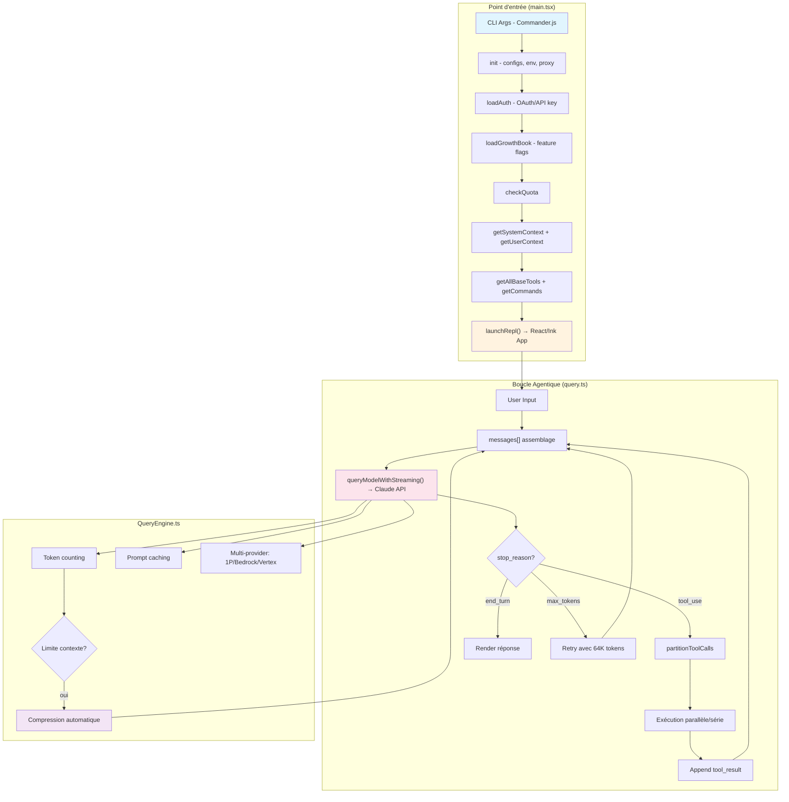
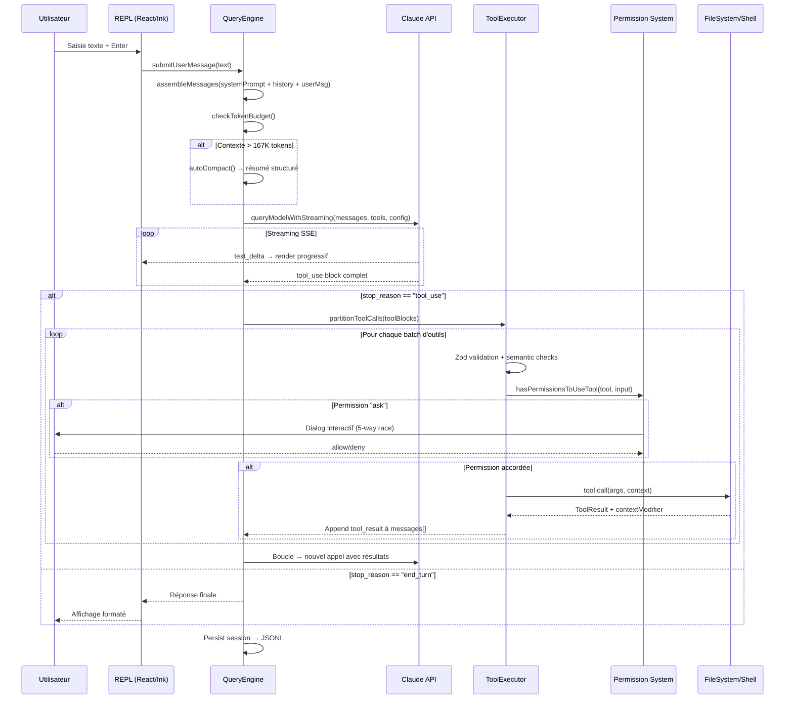
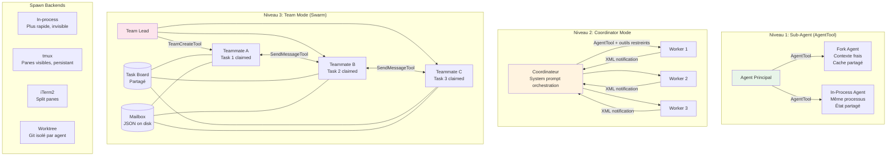
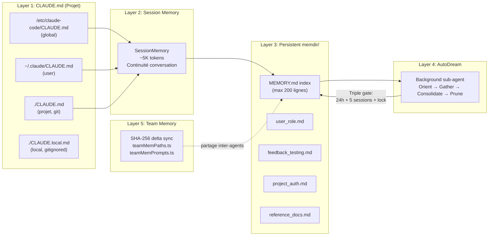
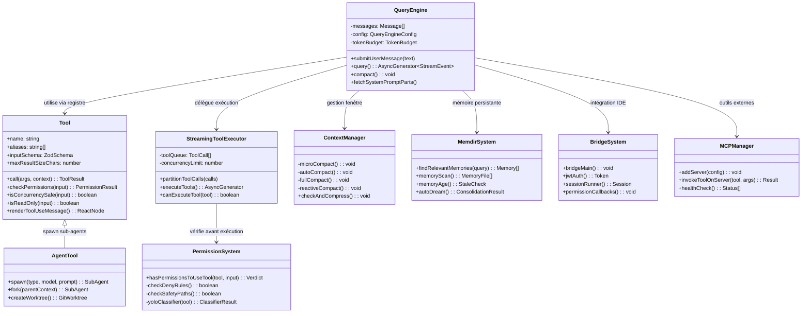
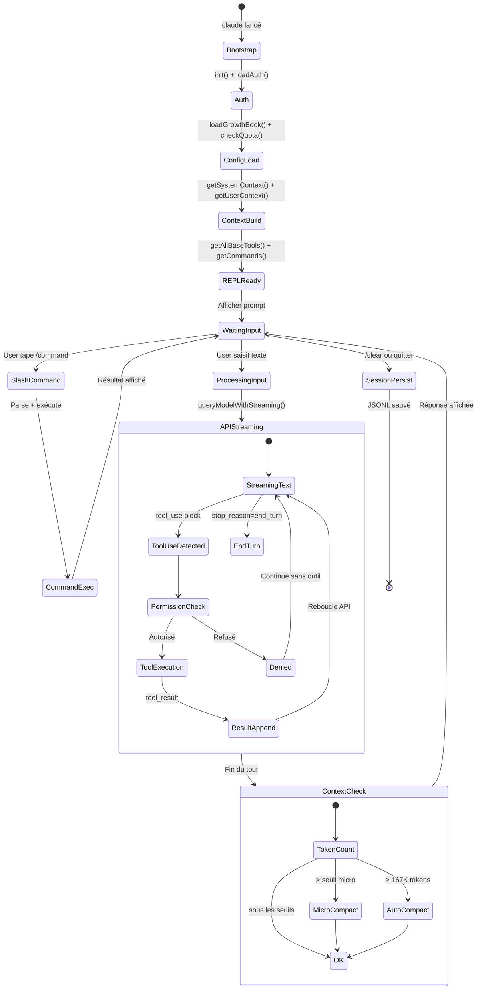

# Reverse engineering complet de Claude Code (Anthropic CLI v2.1.88)

**Le repo `Bogala/claude-code` est l'un des nombreux miroirs du code source fuité de Claude Code**, l'outil CLI agentique d'Anthropic, exposé le 31 mars 2026 via un fichier source map (`cli.js.map` de 59,8 Mo) accidentellement inclus dans le package npm `@anthropic-ai/claude-code@2.1.88`. Ce code représente **~512 000 lignes de TypeScript** réparties sur **~1 884 fichiers**, constituant l'un des agents de codage les plus sophistiqués jamais construits. Son architecture repose sur une boucle agentique progressive à 12 couches, un système multi-agents avec orchestration par équipes, et un TUI React/Ink de ~406 composants — le tout compilé par Bun en un seul bundle `cli.js` de ~12 Mo.

---

## Architecture logicielle : une boucle agentique à 12 couches

Claude Code n'est pas un simple wrapper CLI autour d'une API. C'est un **système agentique de production** construit sur un pattern fondamental enrichi progressivement. La boucle de base est élémentaire :

```
User → messages[] → Claude API → response → stop_reason == "tool_use"? → oui: exécuter → boucler
                                                                        → non: afficher texte
```

Sur cette boucle, Anthropic a empilé **12 mécanismes progressifs** (documentés par shareAI-lab, 45,2k étoiles). **s01 THE LOOP** est la boucle `while(true)` dans `query.ts` (785 Ko, le plus gros fichier). **s02 TOOL DISPATCH** ajoute le registre de ~40+ outils via `buildTool()`. **s03 PLANNING** introduit `EnterPlanModeTool` + `TodoWriteTool` qui doublent le taux de complétion. **s04 SUB-AGENTS** spawn des enfants via `AgentTool` avec contexte frais. **s05 KNOWLEDGE ON DEMAND** charge les skills via `tool_result` plutôt que le system prompt. **s06 CONTEXT COMPRESSION** implémente 3 stratégies de compaction. Les couches s07 à s12 ajoutent le système de tâches, les tâches en arrière-plan, la délégation d'équipe, le protocole de communication `SendMessageTool`, le claiming autonome de tâches, et l'isolation par git worktree.

Le point d'entrée `main.tsx` (4 683 lignes) orchestre un bootstrap optimisé : les lectures MDM, le prefetch keychain, et la préconnexion API se lancent **en parallèle** avant l'évaluation des modules lourds. OpenTelemetry (~400 Ko) et gRPC (~700 Ko) sont différés via `import()` dynamique. Le system prompt est divisé à `SYSTEM_PROMPT_DYNAMIC_BOUNDARY` — tout ce qui précède (instructions, définitions d'outils) est mis en **cache global inter-organisations**, tout ce qui suit (CLAUDE.md, git status) est session-spécifique.



---

## Les composants principaux et leur structure

Le projet suit une architecture modulaire dense. Voici l'arborescence complète avec les responsabilités :

```
src/
├── main.tsx                 # Bootstrap REPL (4 683 lignes)
├── query.ts                 # Boucle agentique async generator (785 Ko)
├── QueryEngine.ts           # Orchestrateur conversation + lifecycle
├── Tool.ts                  # Interface Tool<Input,Output,P> + buildTool()
├── Task.ts                  # Types de tâches, IDs, états
├── tools.ts                 # Registre outils, presets, filtrage
├── commands.ts              # Registre slash commands (~25K lignes)
├── context.ts               # System/user context collection
├── cost-tracker.ts          # Suivi coûts tokens
│
├── tools/                   # ~40+ implémentations d'outils
│   ├── AgentTool/           # Spawn sub-agents + coordination
│   ├── BashTool/            # Exécution shell (23 validateurs sécurité)
│   │   └── bashSecurity.ts  # 9 707 lignes, tree-sitter AST
│   ├── FileReadTool/        # Lecture fichiers
│   ├── FileEditTool/        # Édition partielle (validation TOCTOU)
│   ├── FileWriteTool/       # Création/écrasement fichiers
│   ├── GrepTool/            # Recherche via ripgrep
│   ├── GlobTool/            # Pattern matching
│   ├── MCPTool/             # Invocation serveurs MCP
│   ├── SkillTool/           # Exécution skills
│   ├── TodoWriteTool/       # Gestion tâches
│   ├── WebFetchTool/        # HTTP fetching
│   ├── WebSearchTool/       # Recherche web
│   └── NotebookTool/        # Jupyter
│
├── commands/                # ~80+ slash commands
├── components/              # ~406 fichiers UI (React + Ink)
├── hooks/                   # React hooks + toolPermission/
├── services/                # API, MCP, OAuth, telemetry, autoDream
│   ├── api/claude.ts        # queryModelWithStreaming()
│   ├── mcp/                 # Gestion serveurs MCP
│   └── autoDream/           # Consolidation mémoire
│
├── coordinator/             # Orchestration multi-agents
├── bridge/                  # Intégration IDE (VS Code, JetBrains)
├── remote/                  # Sessions distantes
├── server/                  # Serveur connexion IDE directe
├── memdir/                  # Mémoire persistante (5 niveaux)
├── skills/                  # Système de skills
├── plugins/                 # Système de plugins
├── vim/                     # Mode Vim complet
├── keybindings/             # Configuration raccourcis
├── voice/                   # STT streaming (non publié)
├── buddy/                   # Système Tamagotchi (Easter egg)
├── assistant/               # Mode KAIROS daemon (non publié)
├── ink/                     # Fork custom d'Ink (~2700 lignes Yoga TS)
└── utils/
    └── undercover.ts        # Mode furtif (89 lignes)
```

---

## Le système d'outils et les permissions

Chaque outil est un **module autonome** satisfaisant l'interface structurelle `Tool<Input, Output, P>` définie dans `Tool.ts`. La factory `buildTool()` applique des **defaults fail-closed** : `isConcurrencySafe: false`, `isReadOnly: false`, `isDestructive: false`. Le registre dans `tools.ts` assemble les outils en 3 étapes : `getAllBaseTools()` (catalogue exhaustif, filtré par feature flags) → `getTools()` (filtrage contextuel : mode simple, REPL, deny rules) → `assembleToolPool()` (merge built-in + MCP, tri alphabétique préservant les breakpoints de cache).

**L'orchestration des outils** est gérée par `StreamingToolExecutor` qui démarre l'exécution **avant la fin du streaming API**. `partitionToolCalls()` sépare les outils concurrency-safe (parallèle, plafond de 10) des non-safe (série). Le pipeline complet : validation Zod → validation sémantique → classificateur spéculatif (Bash) → hooks PreToolUse → `canUseTool()` → `tool.call()` → hooks PostToolUse → sérialisation résultat.

Le système de permissions est **bypass-immune pour les chemins dangereux** (`.git/`, `.claude/`, `.bashrc`, `.gitconfig`, `.zshrc`). Le pipeline en 7 étapes évalue les deny rules avant le mode bypass. **6 modes de permissions** existent : `default` (demande pour les actions sensibles), `acceptEdits` (auto-approuve fichiers), `plan` (lecture seule), `dontAsk` (convertit "ask" en "deny"), `bypassPermissions` (tout sauf paths dangereux), `auto` (classificateur IA à 2 étages). Le mode `auto` utilise un yoloClassifier LLM — Stage 1 rapide et conservateur (64 max_tokens), Stage 2 avec chain-of-thought uniquement si Stage 1 bloque. Après **3 refus consécutifs ou 20 total**, le système bascule en mode interactif.

---

## Flow de données complet : de la requête à la réponse



---

## Gestion du contexte et compression

La fenêtre de contexte est structurée en couches avec un budget strict. Le system prompt (outils, permissions, CLAUDE.md) occupe la partie fixe. La conversation (avec `compact_boundary` marquant la frontière entre résumé et messages live) occupe la partie dynamique. **~20K tokens sont réservés** pour la sortie.

**Quatre stratégies de compression** opèrent en cascade. **MicroCompact** (coût zéro API) efface chirurgicalement les anciens résultats d'outils via `cache_edits`. **AutoCompact** se déclenche à ~167K tokens, génère un résumé structuré de 20K tokens avec chain-of-thought dans des tags `<analysis>` (supprimés avant injection), et dispose d'un **circuit breaker à 3 échecs** — ajouté après qu'une analyse BigQuery ait révélé **1 279 sessions** avec 50+ échecs consécutifs (jusqu'à 3 272 retries), gaspillant ~250K appels API/jour. **Full Compact** compresse l'intégralité de la conversation et réinjecte les fichiers récents (max 5K tokens/fichier). **Reactive Compact** est le dernier recours, déclenché par l'erreur `prompt_too_long` de l'API.

---

## Architecture multi-agents et orchestration



Le **claiming autonome de tâches** utilise un mécanisme atomique : chaque teammate scanne le task board et revendique une tâche sans assignation du lead, évitant les doublons. Les **opérations dangereuses** remontent via mailbox au coordinateur — les workers ne prennent jamais de décisions de sécurité autonomes.

---

## Système de mémoire persistante à 5 niveaux



Le système **AutoDream** est un sub-agent en arrière-plan qui consolide la mémoire entre les sessions. Son triple gate vérifie d'abord le temps (≥24h), puis le nombre de sessions (≥5), et enfin acquiert un lock fichier advisory. Le fichier lock utilise son `mtime` comme timestamp de dernière consolidation et le PID dans le body ; il devient stale après 1 heure.

---

## Diagramme de classes/modules



---

## Flux de données global (state machine)



---

## Stack technique et dépendances clés

Claude Code repose sur **~192 packages npm** avec Bun comme runtime. Les dépendances fondamentales sont :

| Catégorie | Package | Rôle |
|-----------|---------|------|
| **Runtime** | Bun | Bundler + runtime, `feature()` DCE |
| **UI** | React + Ink (fork custom) | TUI renderer via reconciler React |
| **Layout** | Yoga (réécriture TS pure, 2700 lignes) | Flexbox terminal, aucune dépendance native |
| **CLI** | Commander.js | Parsing arguments |
| **Validation** | Zod v4 | Schemas outils, configs, inputs |
| **Feature flags** | GrowthBook | Runtime flags, polling horaire |
| **Telemetry** | OpenTelemetry + Datadog | 1P analytics + monitoring |
| **Parsing code** | tree-sitter | AST Bash (23 validateurs sécurité) |
| **Recherche** | ripgrep (via @vscode/ripgrep) | GrepTool |
| **Git** | isomorphic-git / simple-git | Opérations git |
| **Auth** | OAuth 2.0 + JWT | Authentification bridge IDE |
| **MCP** | @modelcontextprotocol/sdk | Client/serveur MCP |

Le système de **feature flags compile-time** via `bun:bundle` est remarquable : **44+ flags** contrôlent l'inclusion de code au build. Le bundler évalue `feature('FLAG')` contre la config de build — si désactivé, le bloc entier est **physiquement supprimé** du bundle (DCE). C'est pourquoi **108 modules** sont absents du package npm : ils n'existent que dans le monorepo interne d'Anthropic.

---

## Portage Rust/ratatui : analyse des défis et équivalences

### Mapping complet des dépendances TypeScript → Rust

| TypeScript | Rust | Notes |
|-----------|------|-------|
| Commander.js | **clap v4** (derive macros) | Standard de facto |
| React + Ink | **ratatui v0.30 + crossterm v0.26** | **Changement de paradigme fondamental** : retained-mode → immediate-mode |
| Anthropic SDK | **anthropic-sdk-rust** ou client reqwest custom | Plusieurs options disponibles |
| ripgrep | **grep-regex + grep-searcher** (crates du workspace ripgrep) | Bindings natifs |
| Zod v4 | **serde + validator** | Le système de types Rust couvre la majorité |
| @modelcontextprotocol/sdk | **rmcp v0.16** (SDK MCP officiel Rust) | Tokio-based, stdio/SSE |
| OAuth 2.0 | **oauth2 v4** | Support PKCE |
| JWT | **jsonwebtoken v9** | Encode/decode/validate |
| tree-sitter | **tree-sitter** (bindings Rust natifs) | Directement disponible |
| OpenTelemetry | **opentelemetry v0.28 + tracing** | Écosystème mature |
| Datadog | **datadog-opentelemetry v0.3** | Preview officiel |
| chokidar (file watch) | **notify v7** | inotify/kqueue/FSEvents natif |
| Git ops | **git2 v0.19** (libgit2) ou **gix** (pure Rust) | Les deux sont viables |
| Markdown | **termimad v0.30** (rendu terminal) + **comrak** (parsing) | |
| SSE streaming | **eventsource-stream** ou **reqwest-eventsource** | |
| Token counting | **tiktoken v0.2** | Supporte les modèles Anthropic |
| Diff | **similar v2** | Bibliothèque diff haute qualité |

### Les 5 défis techniques majeurs

**1. React/Ink → Ratatui (LE plus gros défi)**. Le TUI actuel utilise un **reconciler React custom** avec composants, hooks, virtual DOM, et JSX déclaratif. Ratatui est en **immediate-mode** : redessinage complet à chaque frame depuis un struct état. L'approche recommandée est le **Component Architecture** pattern de ratatui (trait `Component` avec `handle_events()`, `update()`, `render()`) ou l'**Elm Architecture** via `tui-realm`. Les ~406 fichiers composants devront être repensés en ~30-50 widgets stateful.

**2. Boucle agentique async avec streaming**. Le `QueryEngine` utilise un async generator TypeScript qui yield des événements SSE. En Rust : `tokio::select!` entre événements clavier (crossterm), stream SSE API (reqwest + eventsource-stream), événements MCP, et file watchers — le tout concurrent.

**3. Multi-agent spawning**. Fork = `tokio::process::Command` ; worktree = `git2` ; inter-agent = `tokio::sync::mpsc` channels ; les 13 opérations TeammateTool doivent être réimplémentées avec des abstractions Rust (trait objects ou enums).

**4. Système de permissions bypass-immune**. Le pipeline à 7 étapes avec 5-way race pour le dialog interactif nécessite un design soigné en Rust avec `tokio::select!` et des `oneshot` channels pour la résolution atomique.

**5. Scope total**. Claude Code est ~512K LOC sur ~1 884 fichiers. Même ClaURST (la réimplémentation Rust la plus avancée, 8K étoiles) couvre le comportement mais pas tous les edge cases. Les réimplémentations Python (nano-claude-code, claw-code) montrent qu'un MVP fonctionnel nécessite **~5 000-10 000 lignes**.

### Réimplémentations existantes en Rust

**ClaURST** (Kuberwastaken, ~8K étoiles) est la référence : clean-room en 2 phases (spec d'abord, puis implémentation depuis la spec). Utilise clap + ratatui + crossterm + tokio + reqwest. Revendique 100% de couverture comportementale avec **30-80 Mo de mémoire** vs 200-400 Mo pour Node.js. Un **PR communautaire** (#41568) sur anthropics/claude-code propose une architecture Rust à 16 crates. Le projet `srothgan/claude-code-rust` prend une approche hybride : TUI Rust (ratatui) + bridge TypeScript (agent-sdk) via JSON lines sur stdin/stdout.

### Stack Cargo recommandée

```toml
[workspace.dependencies]
tokio = { version = "1", features = ["full"] }
clap = { version = "4", features = ["derive"] }
ratatui = "0.30"
crossterm = "0.26"
reqwest = { version = "0.12", features = ["json", "stream"] }
eventsource-stream = "0.2"
serde = { version = "1", features = ["derive"] }
serde_json = "1"
rmcp = { version = "0.16", features = ["client", "server"] }
git2 = "0.19"
tiktoken = "0.2"
oauth2 = "4"
jsonwebtoken = "9"
keyring = "3"
notify = "7"
globset = "0.4"
similar = "2"
termimad = "0.30"
tracing = "0.1"
tracing-subscriber = "0.3"
color-eyre = "0.6"
```

---

## Guide d'utilisation optimal de Claude Code

### CLAUDE.md : le levier le plus puissant

Boris Cherny (créateur de Claude Code) recommande de garder CLAUDE.md **sous ~100 lignes / ~2 500 tokens**. La règle d'or : *"Chaque fois que Claude fait une erreur, ajoutez-le à CLAUDE.md pour qu'il ne la répète pas."* Incluez les commandes de build, les conventions de code, les gotchas spécifiques — excluez tout ce que Claude peut inférer du code. Utilisez `/init` pour générer une version initiale, puis éditez impitoyablement. Supportez la syntaxe `@path/to/import` pour moduler le contexte.

### Workflows efficaces

- **Shift+Tab** cycle entre Normal → Auto-Accept → Plan pendant la session
- **`/clear`** entre chaque tâche non liée — l'habitude la plus importante
- **`/compact Focus sur les changements API`** à 50% du contexte, n'attendez pas l'auto-compaction
- **Subagents pour investigation** — ils explorent en contexte séparé, renvoient des résumés
- **Pattern Writer/Reviewer** — une session écrit, une autre review avec un contexte frais
- **Mode non-interactif** : `claude -p "Fix all lint errors" --permission-mode auto`
- **Skills** pour le knowledge on-demand : créez des SKILL.md dans `.claude/skills/` avec frontmatter YAML

### Hooks essentiels

Les hooks sont des **déclencheurs déterministes** (contrairement au CLAUDE.md qui est consultatif). `SessionStart` pour injecter le contexte git au démarrage, `PostToolUse` avec matcher `Edit|Write` pour formatter automatiquement (`prettier`), `PreToolUse` avec matcher `Write` pour bloquer la modification de fichiers `.env`. Code de sortie **2** = bloquer l'action et montrer l'erreur à Claude.

### Optimisation des coûts (60-80% d'économies)

Utilisez Sonnet comme défaut (80%+ des tâches), basculez vers Opus uniquement pour l'architecture complexe (`/model opus`), et utilisez `opusplan` pour le mode hybride (Opus planifie, Sonnet exécute). Réduisez `MAX_THINKING_TOKENS` à 10 000 (défaut 31 999). Assignez Haiku aux subagents via `CLAUDE_CODE_SUBAGENT_MODEL=haiku`. Surveillez avec `/cost`.

---

## Conclusion : un système d'ingénierie remarquable

L'analyse du code source de Claude Code révèle **trois insights architecturaux majeurs**. Premièrement, la puissance vient de la simplicité de la boucle de base — `while(true) { call API → execute tools → loop }` — enrichie progressivement par 12 couches orthogonales. Chaque couche est découplable et testable indépendamment. Deuxièmement, le **système de compression contextuelle à 4 niveaux** avec circuit breaker est une innovation critique pour les agents longue durée — sans lui, Claude Code ne pourrait pas gérer des sessions de plus de quelques échanges. Troisièmement, le modèle multi-agents avec claiming autonome et isolation par worktree représente l'état de l'art des systèmes agentiques de production, loin devant les approches académiques.

Pour un portage Rust, le **vrai défi n'est pas algorithmique mais paradigmatique** : passer de React/Ink (retained-mode, composants, hooks) à ratatui (immediate-mode, struct état) demande une refonte complète de la couche UI, pas un portage ligne par ligne. Les réimplémentations existantes (ClaURST, nano-claude-code) montrent qu'un MVP solide est atteignable en 5 000-10 000 lignes, mais reproduire la totalité des ~512K LOC et des 108 modules internes reste hors de portée.